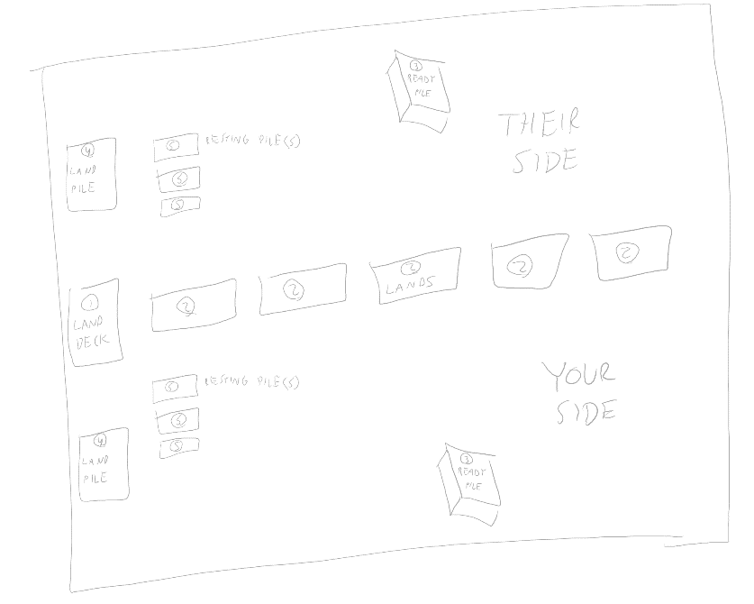

Creature Combat Territory

Creature Combat Territory is a card game about deploying your creatures to various lands to engage in battle so that you can claim the lands.

# Win Condition

You win by claiming the most lands by the end of the game. The game ends when there are no more lands left to claim.

# Contents & Materials

In this game, there are two card types: Creature cards and Land cards. Creatures are the units that you send into battle, and Lands are the battlegrounds where you send them to fight.

You need to bring a deck of Creatures and a deck of 25 Lands. Creature decks must have a total combined cost of 100 points, as determined by each Creature’s cost. There is no card minimum or maximum for the Creature deck. There is no limit to how many copies of a particular Creature you can have in your deck. See page TODO for more detailed Deck construction rules.

You will also need some way to keep track of Damage counters and Rest counters. A set of dice, trackers, tokens, and pips are all good options. Damage counters are often between 5 and 10, but can go as high as 50 and beyond in rare cases. Rest counters usually go between 1 and 3, and rarely get above 5.

You will most likely want to use card sleeves for both your Creature Cards and Land cards, especially for your Land cards. Your Land cards will be shuffled in with your opponent's Land cards, so it’s important that you have distinct sleeves so you can easily find your Land cards after the game is over.

# Setup

1.  Shuffle your Land deck.
2.  Shuffle your opponent’s Land deck.
3.  Shuffle your Land deck into your opponent's Land deck, creating a combined Land deck.
4.  Place your Creature deck face down on the table. No need to shuffle it. This is your Ready pile.

# Table Layout

In a 2 player game, the table will be laid out like this:

1.  Land Deck – this is where you draw Lands from at the beginning of the round
2.  Lands – these are the Lands in play that you can deploy Creatures to
3.  Ready Pile – this is the pile of Creatures that you can deploy Creatures from
4.  Land Pile – this is your personal pile of Lands that you have claimed
5.  Resting Pile(s) – these are piles of your Creatures that are resting for a number of rounds indicated by their Rest counters and cannot be deployed
6.  Returning Pile – the Creatures that will be ready next round

# Card Layout

There’s two types of cards: Land cards, and Creature cards.

## Land cards

Land cards are the battlegrounds where your creatures fight. Winning in a battleground lets you claim that Land for yourself, getting you closer to winning the game.

TODO: pic

1.  Name – the name of this specific location.
2.  Biome – the biome of this Land. Creatures use this to determine their Biome Bonus.

## Creature cards

Creatures are the units that battle on the Lands to win them for your team.

TODO: pic

1.  Name – where you write your Creature’s name on the card with a pen, pencil, or other writing utensil in your own handwriting. Yes, this is meant to be permanent.
2.  Species – the species name of your Creature.
3.  Cost – how much this Creature costs to include in your Creature deck.
4.  Stars – a general indication of the Creature’s power level. The more stars it has, the more powerful it is.
5.  Types – a list of type tags that identify what groups this Creature belongs to.
6.  Art – the card art that shows what the Creature looks like.
7.  Ability – what the Creature can do.
8.  Base Power – how powerful the Creature is no matter where it’s fighting. Also used as “health” and as a resource to use abilities.
9.  Biome Bonus – how much more powerful the Creature is in that particular biome. The Biome Bonus is added to the Base Power to get the Creature’s power.
10. ID – the ID of this Creature card on the Creature Combat website, so that you can verify that it follows the card construction rules.
11. Variant \# - which variant of this species it is.
12. Version \# - the version number of the card generator used to make this card.

# Gameplay

There’s 4 phases to each round:

-   Round Begin
-   Deploy
-   Combat
-   Round End

## Round Begin

Deal 5 land cards into the space between players.

## Deploy Creatures

Each player deploys any number of their ready Creatures to the 5 Lands. You can spread them out however you wish. You can add any number of Creatures to each Land. You don’t have to deploy all your Creatures. You don’t have to deploy Creatures to each Land.

To deploy a Creature, place it face down in front of the Land you wish to deploy it to. If you deploy multiple Creatures to the same Land, place them in the same pile.

Each Creature receives a bonus or detriment depending on where it gets deployed. While a Creature is at a Land, it uses the Biome Modifier that matches the biome of the Land it’s at. If its Biome Modifier is positive, it gets a Biome Bonus; but if its Biome Modifier is negative, it gets a Biome Detriment.

If a Creature has a Biome Bonus, it is considered to be in a home biome. Some Creature abilities require the Creature to be in a home biome in order to activate.

## Combat

Do combat for each Land separately. For each Land:

1.  Reveal your Creatures deployed at that Land.
2.  Count up your Creatures’ total power at that Land.
3.  Determine which player has the highest total power.
4.  If you have the highest total power, you claim that Land.
    1.  If two or more players are tied for highest total power, it’s a draw, and the Land does not get claimed.
5.  If you claim the Land, put it in your Land pile.
6.  Pull back your deployed creatures.
    1.  If a creature has Base Power 0 or less, put 1 additional Rest counter on it.
    2.  If a creature has at least 1 Rest counter on it, place it in a separate Resting pile based on how many Rest counters it has.
    3.  If a creature has no Rest counters on it, then place it in your Returning pile.

## Round End

When the round ends, do the following:

1.  Move Creatures from your Returning pile into your Ready pile.
2.  If you have Resting piles with Rest counters on them,
    1.  Remove 1 Rest counter from each Resting pile.
    2.  If a Resting pile now has 0 Rest counters, move it into your Returning pile.
3.  If you have Lands in your Land pile,
    1.  For each Land card, you may remove 1 Rest counter from 1 Creature.
    2.  Move that Creature to the Resting pile that has the same amount of Rest counters.
    3.  If that Creature’s last Rest counter is removed, move it to your Returning pile.
    4.  You may remove multiple Rest counters from a single Creature.
    5.  You may remove Rest counters from multiple Creatures.
    6.  Alternatively, you may move 1 Creature from your Returning Pile to your Ready pile.
4.  Then move onto the next round.

# Ending the Game

The game ends when there are no more Land cards left to claim. If you have the most Land cards, you win the game.

Alternatively, if you claim a majority of the Lands at any point in the game, all players may agree to declare you the winner and end the game early.

You may concede at any time, losing the game. When you concede, the Land cards you claimed don’t go back into the Land deck.

When the game ends, you may take back the Land cards you own from the Land deck and other players’ Land piles.

# Deck Building

Each player comes to the table with a deck of Creatures and a deck of Lands. The total cost of your Creature deck and the amount of Lands in your Land deck can vary from the rules below, but the total cost and Land amount must be agreed upon by all players ahead of time.

## Creature Deck

Your Creature deck can have a total cost of 100 or less. Each Creature has a cost ranging from 1 to 100, depending on its stats and abilities. There is no minimum or maximum card count. There is no limit on duplicate Creatures. You could have 10 Creatures in your deck that each cost 10, or 100 Creatures that each cost 1, or just 1 Creature that costs 100. It’s up to you to decide what’s optimal for your deck.

## Land Deck

Your Land deck must contain 25 Lands. Your Lands and the opponent’s Lands will be shuffled together into the same deck, so it’s best if you use card sleeves for the Lands with backs distinct from your opponent’s.

# Custom Card Creation Rules

There’s two types of cards that you can create custom cards of: Land Cards, and Creature Cards.

## Land Cards

You can create your own custom Lands. Each Land needs a name and a biome.

Each Land card must have a biome. Choose from these biome options:

-   Forest
-   Mountain
-   Plain
-   Lake
-   Ocean
-   Swamp
-   Desert
-   Tundra
-   Jungle
-   Volcano

The Land’s biome is what Creatures use to determine their Biome Bonus.

## Creature Cards

You can create your own custom Creatures. The rules for this are quite complex, so it’s recommended that you go to the following website and use the Creature Combat card creator to make your custom Creature card: TODO: website

Here are the creature stats:

-   Name – The name of this individual creature.
-   Species – The species name of this creature.
-   Type – Any type tags you want to apply to this creature (Flying, Canid, Ungulate, Fire, etc.)
-   Star Count – How powerful this creature is
-   Total Cost – The cost of putting this card in your creature deck.
-   Base Power – The power of this creature, Irregardless of which biome it’s fighting in
-   Biome A Bonus – The power bonus this creature receives when fighting in Biome A. Each creature can have multiple of these
-   Ability – An ability this creature can use, often costing rest time or requiring it to be in a home biome

### Name

Give this creature a name, and write it on the card, with your own handwriting. This gives it a personal touch and makes the creature more personal to you. It’s like naming your Pokemon.

### Species

This is the name of the species of the creature, often printe in ink like the rest of the card.

### Type

What kind of creature is this? Use types like in Magic The Gathering: you can have any amount of types, and in any variety. There’s some that are included in the base game, but you can have your creature be any type you want. There’s no type bonuses in the base mechanics like in Pokemon, so don’t worry about playing your Fire type creature into an opponent’s Water type creature. Types work like in Magic The Gathering, in that abilities of certain creatures and lands reference those types to give tribal bonuses and effects.

### Star Count

A creature’s star count is a way to quickly gauge how powerful it is. A creature’s Star Count is equal to its Final Cost divided by 10, round up.

### Total Cost

The total cost of a creature is determined by its other stats: Base Power, Biome Bonuses, and Abilities.

The base total cost is 0, and then you add to this when you add points to the other stats.

For each point in Base Power, increase Total Cost by 2.

For every 2 points in any Biome Bonus, increase Total Cost by 1. If you have 1 point left over, count it as 2.

Abilities have varying costs depending on what it does and the requirements to play it.

Total Cost = (Base Power \* 2) + RoundUp(Total Biome Bonus / 2) + (Total Ability Cost)

If your creature’s total cost is high enough, it might be eligible for cost discounts. For example, if your creature’s Base Total Cost is 90, it would be eligible for a cost reduction of let’s say 9, making its Final Total Cost equal to 81.

The Final Total Cost is what you use to determine the total cost of your deck. The Final Total Cost has a minimum of 1.

### Base Power

This is the power of the creature no matter in which biome it is fighting.

### Biome Bonus

This is the power bonus the creature receives when it is fighting in the given biome. Each biome bonus declares a biome and a bonus. When the creature fights in that specific biome, they get that bonus to their power.

The biome bonus can be negative. A shark wouldn’t fare too good on a mountain, for example.

Each creature can have multiple biome bonuses. A deer is good in the mountains, in the forest, and in the plains, for example.

If a creature has a positive bonus in a biome, it is said to be a home biome. Some abilities require a creature to be in a home biome to activate.

If the creature is fighting in a biome in which it doesn’t have a biome bonus or detriment for, it just uses its Base Power with no biome bonuses.

### Ability

Each creature can have one or more abilities.

An ability might have a cost associated with it, which must be paid to activate it. For example, it might require that the creature gains 2 Rest counters when it leaves the battlefield. Or an ability might require that the creature is in a home biome in order to activate.

Some abilities are passives which activate when a certain condition is met.

Some abilities are activatable. You can activate these abilities at any time, as long as the creature is deployed to a land. Creatures in your Ready piles and Resting piles cannot use their abilities. You can activate each creature’s ability only once per round. You can activate multiple creatures’ ability per round, even if those creatures are deployed to the same land. If a creature has more than one ability, you may activate more than one in a round.

Some abilities require the creature to not add its power to the total in order to use.

Unless otherwise specified, a creature’s ability effects are limited to the land they are on, unless otherwise specified. For example, “All creatures gain +1 power.” This means all creatures on that land, and not other creatures on other lands.

# Creature Abilities

Each creature can have one or more abilities.

Here’s some examples of abilities creatures can have.

-   Roar – 1 Rest Counter: All other creatures get -1 Base Power.
-   Shield – Support: Enemy effects can’t make ally creatures lose Base Power.

Each ability has the following:

-   Name
-   Cost
-   Requirement
-   Effect

## Name

The name of the ability, for easy reference. Each species might name the ability differently, even if it has the same effect. For example, an octopus might have a grab move called “Tentacle”, while an T-Rex’s grab move would be called “Jaws”.

## Cost

What does it cost to use this ability? Activating the ability requires some kind of change of game state.

Common costs:

-   Rest X – Add X amount of rest counters to the creature when it activates this ability.
-   Support – This creature doesn’t add its power to the Total Power for claiming the land.
-   Exhaust X – This creature loses X amount of Base Power.
-   Sacrifice – This creature is removed from the game when the round ends.
-   Disorient X – This creature loses X amount of Biome Bonus in the relevant biome.

## Requirement

What conditions need to be satisfied in order for this ability to be active / be activated? The game state needs to meet this condition for it to work.

Common requirements:

-   Home – The creature must be in a home biome. If the creature would be in a home biome but its biome bonus has been reduced to 0 or below, then this condition is longer met.
-   Biome A – The creature must in biome A. It doesn’t matter if the creature has a bonus or not in this biome.
-   Type Group – The creature must be fighting with another ally creature that shares a type.
-   Type Group X – The creature must be fighting with at least X other ally creatures that share at least one type with it.
-   Type Group A – The creature must be fighting with another ally creature that shares type A with it.
-   Type Group A X - The creature must be fighting with at least X other ally creatures that share type A with it.
-   Alone – The creature must be fighting alone.

## Effect

The change to the game state this ability makes while active / when activated.

Common effects:

-   Allies get +1 Base Power.
-   Enemies get -1 Base Power.
-   Allies of type A get +1 Base Power.

## Taking Damage

Creatures don’t have hitpoints, per say, but some abilities say “Deal 2 damage” for example. When a creature takes damage, its Base Power is reduced by that amount. A creature’s Base Power cannot be reduced below 0. If a creature’s Base Power is reduced to 0, it gets a number of extra Rest counters equal to its Star Count.

All damage is removed when the creature leaves the battlefield.
