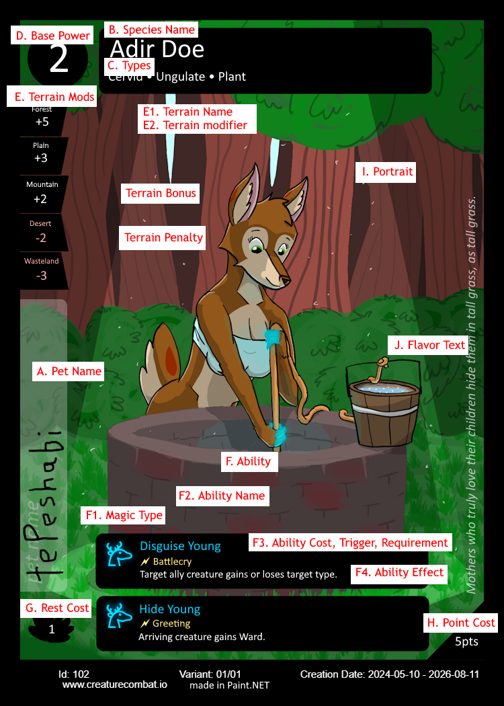

# Wyl Creature Combat New Player Guide

This new player guide is for players who are starting out and have gotten their cards from somewhere other than a starter set.

# Goal

Claim the most landmarks by the end of the game. The game ends when all landmarks have been claimed.

# Pieces

To play a game of Wyl Creature Combat, each player will need:

-   A deck of creatures totaling 100pts. See Deck Rules below.
-   A deck of 5 unique landmarks. See Deck Rules below.
-   A way to keep track of values. Dice, paper clips, poker chips, pen & paper, a notes app, etc work well for this
-   A way to hide your initial hand. Holding your deck under the table, a manila folder, some type of divider, etc works well for this
-   A way to keep track of creatures’ cooldowns. Dice as mentioned above work for this too, but a custom playmat with cooldown tracking zones is recommended

Additionally, collectively you will need:

-   A hard flat surface to play on. A table works well for this
-   A method to determine who goes first. Dice, rock paper scissors, “youngest goes first”, etc work well for this
-   A way to remember whose turn it is. Just remembering it works well for this, but you can also use a stuffed animal to pass around
-   A permanent marker, pen, or other writing utensil used to write on the cards

# Deck Rules

When you make your own creature deck, here are the rules it must follow:

-   The point cost total of creatures in the deck must be 100 or less. The point cost is displayed on the bottom right corner of each creature.
-   You may have any number of copies of a creature
-   At least one creature in the deck must be named. A named creature is one that has a name written in its pet name field
-   That’s it

When you make your own landmark deck, here are the rules it must follow:

-   It must contain exactly 5 landmark cards
-   You may only have 1 copy of each landmark in your deck
-   Landmarks may share the same terrains

# What is a Creature

A creature is a living being in card form.

1.  Pet Name  
    The name you give this individual creature
2.  Species Name  
    The name of this creature’s species
3.  Types  
    The type of creature it is
4.  Base Power  
    This helps the creature win fights and stay alive. This is the base value for a creature’s power total.
5.  Terrain Mods  
    When a creature is in this terrain, it the terrain modifier is added to its base power to get its power total.
6.  Ability  
    Creatures can do various things, magical or otherwise.
    1.  F1. If the ability is magical, the symbol of the magic type is displayed here.
    2.  F2. The name of the ability
    3.  F3. The cost must be paid to activate the ability. The trigger is a condition that lets you activate an ability on any player’s turn. The requirement must be met for an ability to resolve. The effect is what the ability does.
7.  Rest Cost  
    When the battle ends, this is how long the creature needs to recover.
8.  Point Cost  
    This is how much it costs to have this creature in your army.
9.  Portrait  
    A picture of the creature.
10. Flavor Text  
    Some added info or poetic statement about the creature.

# Setup

Shuffle all players’ landmarks into one big pile.

Each player sets their creature deck (called their “army”) on the table, and turns a named creature face up on top of it. A “named creature” is a creature with a name written in the pet name field.

# Zones

There are 3 zones:

-   Army (each player)
-   Battle (only 1)
    -   Hand (each player)
-   Resting (each player)

Each player has an army zone, which has every creature that a player can deploy to a landmark.

The battle zone includes the current landmark and all creatures at that landmark.

Each player has a hand, which contains all creatures deployed to that landmark but who haven’t arrived yet. When a player plays that creature, that creature arrives at the landmark. This zone is part of the battle zone.

Each player has a Rest zone, where their creatures go to rest between battles.

# Round

## Deploy

At the start of each round, take the top card off the landmark deck and place it face up in the center of the table.

Players secretly pull creatures from their army to later deploy to the landmark.

Once all players have pulled creatures, all pulled creatures get deployed to the landmark, getting placed in the player’s hand.

Randomly determine who goes first. For fairness, you can let a player who hasn’t gone first recently or the player with the least amount of landmarks go first.

## Play

On a player’s turn, they may take 1 action:

-   Play a creature
-   Activate a creature’s ability
-   Fight a creature
-   Resolve the battle

When the current player takes an action, it starts a moment, in which other players can react to their action. Each creature (of each player) can take 1 reaction:
•	Activate an ability
•	Block an action
•	Help a creature

Ater a player takes their turn, play continues to the player on their left (clockwise).

### Actions

**Play a creature:** To play a creature, move it from your hand to the landmark.

**Activate a creature’s ability:** To activate a creature’s ability, pay its cost (if any), and declare the ability: “I’m activating [ability name].” Then, when it comes up in the queue, it resolves, and does its effect. See the Moments section below.

**Fight a creature:** To fight a creature, choose a friendly creature (one of your creatures) and target a hostile creature (one of your opponent’s creatures). The creature with the highest power total is the victor, and it deals damage to the other equal to the victor’s base power. See the Fight section below.

**Resolve the battle:** To resolve the battle, declare that you want to resolve the battle. The player with the highest combined power total claims the land. See the Battle section below.

### Reactions

**Activate an ability:** To reactively activate a creature’s ability, it must first have been triggered by another action or reaction it or another creature took. Once triggered, you pay the ability’s cost (if any), and declare that your creature is activating its ability. Then, when it comes up in the queue, it resolves, and does its effect. See the Moments section below.

**Block an action:** If one of your creatures is being targeted by an opposing creature’s action (such as an attack or ability), you may have another creature of yours use its reaction to block the action. The blocking creature then becomes the new target for the action.

**Help a creature:** A creature may use its reaction to help another creature take its action or reaction. Choose one:

-   **Help speed:** Increase the action’s speed by 1
-   **Help pay:** Contribute 1 to paying the cost, if applicable.

If the cost is increasing exhaust value, for example, the helping creature can increase its exhaust value by 1 so that the acting creature can increase its exhaust value by one less. EX: Starfur activates bright light, which costs Exhaust 3, meaning Starfur has to increase its exhaust value by 3. But then Adir Doe helps pay by increasing its exhaust value by 1, so Starfur only has to increase its Exhaust value by 2.

## Fight

To fight, choose one of your creatures to fight an opponent’s creature. That opponent has the opportunity to declare a blocker. Your creature then fights the blocker instead.

Note that your attacking creature is spending its action to fight, which means that it can’t activate any of its abilities in this moment. However, if the ability has the 🗲Fight keyword, then it can activate its ability right before the fight is resolved.

Note that the defender has not spent its action to do anything, so it can activate any applicable triggered ability during the moment. However, if the defender is a blocker, then it spent its action to block, and thus cannot activate its abilities. But if the ability has the 🗲Fight keyword, then it may activate that ability, and it will resolve right after the block resolves in the queue.

When the fight resolves, calculate each fighting creature’s power total. The creature with the highest power total is the victor. The victor deals damage equal to its base power to the other fighting creature. If the victor’s power total is double the power total of the loser, then the damage is doubled.

If there’s a tie, then no damage is dealt.

If there’s multiple creatures in a fight, then the victor deals damage to all creatures hostile to it. If there’s a tie for highest power total, but the creatures with the highest power total are all on the same team, then they are each the victor and each deal their damage to the opposing creatures. If the tied creatures are on opposing teams, then no damage is dealt.

## Battle

When a player spends their turn to resolve the battle, all players calculate their creatures’ combined power total. The player with the highest combined power total wins the battle, and claims the landmark. If there’s a tie for highest power total, then no player claims the landmark and it gets shuffled back into the landmark deck.

At the end of a battle, if there are no landmarks left, the player who claimed the most landmarks wins the game. If there is a tie for most landmarks, the tied player who most recently claimed a landmark wins.

## Rest

When the landmark is claimed and the game does not end, each player does the resting process. For each creature at the landmark and in a player’s hand, increase its exhaust value by its rest cost. Then move all creatures from the battlefield to its Resting zone. Finally, decrease the exhaust value of all creatures in the resting zone by 1, and return all creatures that have no exhaustion value to its army.

## End

The round ends.

# Values

Values show the state of a creature. All values start at 0 and reset to 0. Values can’t be negative. “Good values” are beneficial, like bonus power. “Bad values” are harmful, like damage. A creature “has” a value if that value is greater than 0.

It’s recommend to use something like dice or a tracking app to keep track of each creature’s values.

Common values:

-   Exhaustion value. After battling, each creature’s exhaustion value increases by its rest cost. While a creature has an exhaustion value, it can’t return to your army. A resting creature’s exhaustion value decreases by 1 at the end of each round.
-   Bonus Power value. This is added to a creature’s base power and terrain mods to get their power total. Note that power total isn’t a value, because it is calculated, not tracked.
-   Damage value. This represents the amount of damage this creature has taken. If a creature’s damage value is equal to or greater than their base power, they are “downed”. A downed creature doesn’t contribute their power total to the combined power total in the finale, and can’t join fights.
-   Stun value. If a creature has a stun value, they are stunned: their abilities do not resolve. At the end of each player’s turn, each friendly creature decreases its stun value by 1.
-   Shield value. A creature’s shields is equal to its shield value. While a creature has shields, damage is dealt to its shields first. Gaining shields doesn’t heal a creature.

# Totals

A total is a calculation of values and printed numbers to get a result.

For example, a creature’s power total is equal to its base power plus its bonus power value, plus any terrain mods it has.

# Creature Types

A creature is one or more types.

Types are descriptors used to specify what kind of creature it is, and allow players to determine which creatures are alike by the types they share. Although types have no meaning by themselves, some creatures may have abilities that only work with creatures of a certain type.

# Keywords

A creature and their abilities may have keywords in them. A keyword is a word that is shorthand for a phrase, sentence, or ability.

-   Trigger keywords are shorthand for “When [trigger] happens, you may activate this ability.”
-   Cost keywords are shorthand for “You must pay [cost] in order to activate this ability.”
-   Requirement keywords are shorthand for “If [condition] is not met, this ability is canceled.”
-   Ability keywords can be a mixture of the other kinds of keywords.

# Magic Types

There are different types of magic in Wyl, and each one has its own symbol. This magic symbol is shown next to the ability, if that ability uses magic to achieve its effect.

# Abilities

Each creature can have abilities. An ability can be activated manually on a player’s turn or triggered by another event. An ability with a trigger can be activated manually, and triggering an ability when its event happens is optional.

If an ability has a cost, it must be paid in full to activate it.

If an ability has a requirement, that requirement must be met for the ability to resolve. An ability with unmet requirements can still be activated, but its requirements must be met by the time it gets processed by the queue.

# Speeds

Abilities and actions have a speed that may allow them to jump ahead in the queue. From fastest to slowest, the speeds are Super Fast, Fast, Normal, Slow, Super Slow. A reacting ability that has a speed faster than the ability it reacts to may go before it in the queue. If an ability does not specify a speed, it is always Normal speed.

# Moments

A moment is a small period of time in which a lot can happen. Player actions and creature abilities all happen inside a moment.

As a player action, a player can:

-   Play (a creature from their hand to the landmark)
-   Activate (a creature ability)
-   Fight (a hostile creature with a friendly creature)
-   Resolve (the battle)

When a player takes the first action on their turn, it starts a moment. This can trigger abilities of creatures, who can then activate those abilities. And those abilities can trigger other abilities, and so on. When no more creatures are activating their abilities, the moment starts to resolve. Each creature can activate an ability only once per moment.

The moment has a queue system that determines the order of the abilities. The abilities are generally ordered by the order they were activated, but an ability can skip ahead in order under certain conditions.

When an ability is triggered, it goes in the queue right behind the action that triggered it. However, the reacting creature (the creature with the triggered ability) may decide to act right before the acting creature (the creature of the action) if any of these conditions are met:

-   The reacting creature has a lower base power than the acting creature
-   The triggered ability has a faster speed than the action
-   Both creatures are friendly to each other
-   It’s the reacting creature’s turn, or the reacting creature will have its turn sooner than the acting creature

As a reaction, a player may play a creature with a Battlecry ability. The played creature’s arrival and Battlecry ability activation happen together, at the speed of the Battlecry ability.

When a player action triggers the ability of the acting creature, the action and the reaction happen at the same time, with no other creature’s ability in between. This is called adjoined actions, and they use the speed of the ability, if their speeds are different.

## Example

When reacting to an ability that is itself reacting to another ability, the second reaction goes in the queue relative to the ability it is reacting to.

Here, he have an Adir Doe and Hexantler Buck against an Embird and a third player with a Fyrorage, and it’s the Embird’s turn.

|   | **What each creature does**                                                 | **Queue**                   |
|---|-----------------------------------------------------------------------------|-----------------------------|
| 1 | Embird targets Adir Doe with Flame Spit                                     | Embird                      |
| 2 | Hexantler Buck chooses Adir Doe with Shielding at fast speed                | Hexantler, Embird           |
| 3 | Fyrorage reacts to Hexantler by amplifying Embird’s damage, at normal speed | Hexantler, Fyrorage, Embird |

1\. Embird targets Adir Doe with Flame Spit

Queue: Embird

2\. Then Hexantler Buck chooses Adir Doe with Shielding. Shielding would go behind Embird’s Flame Spit, but because Shielding has a fast speed and Flame Spit has a normal speed, Shielding goes before Flame Spit.

Queue: Hexantler, Embird

3\. Then a third player’s Fyrorage reacts to Hexantler by amplifying Embird’s damage, at normal speed.

Queue: Hexantler, Fyrorage, Embird

Fyrorage has higher base power than Embird, so if Fyrorage reacted to Embird, it would go after. Which is pointless, because it wants to damage boost before the damage is dealt. But Fyrorage reacted to Hexantler, which reacted to Embird and went before it, so Fyrorage gets to go before Embird, but after Hexantler.
